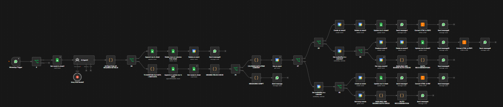
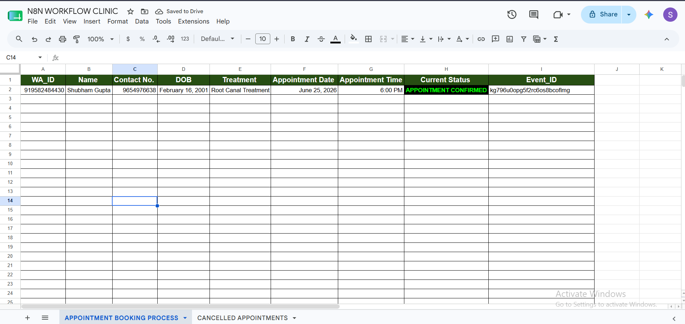
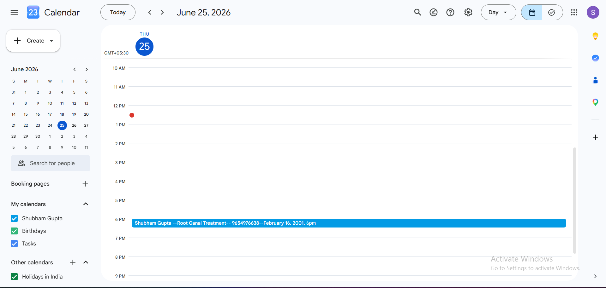
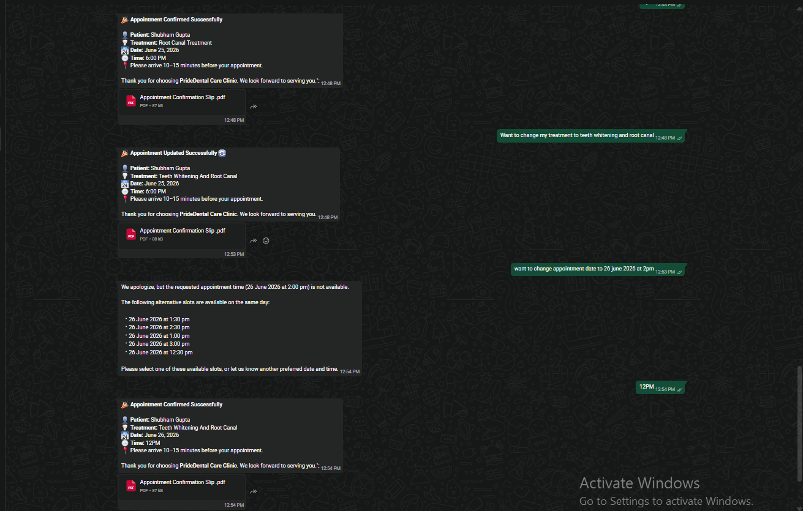
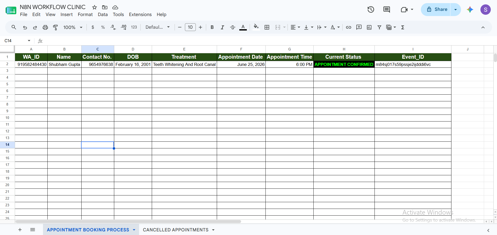
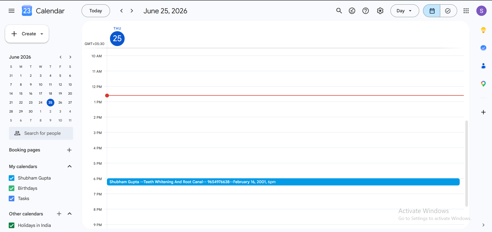
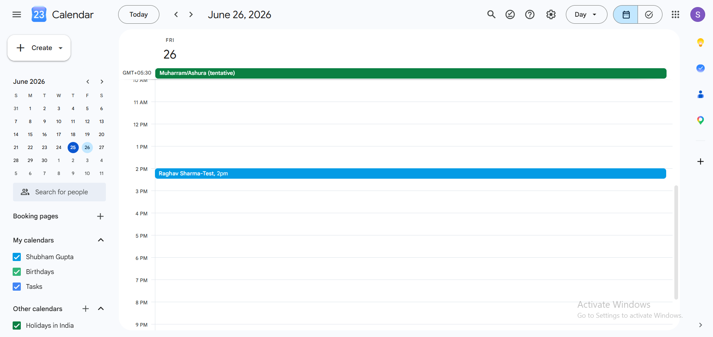
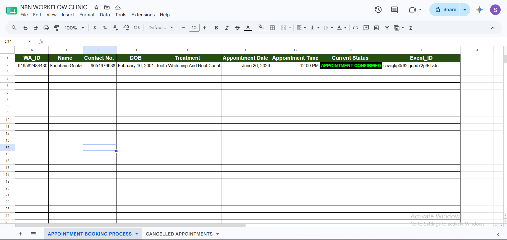
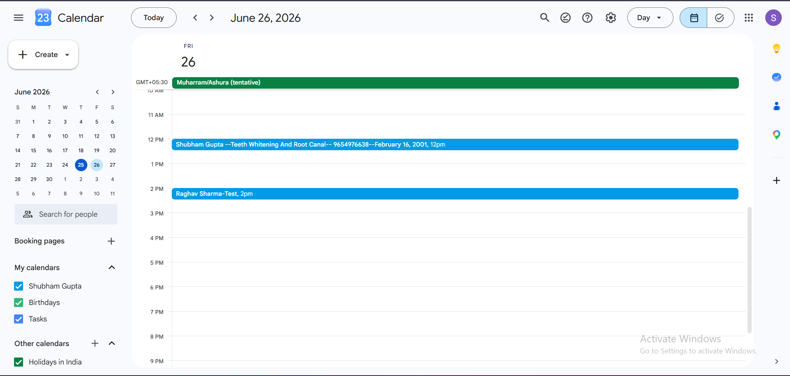
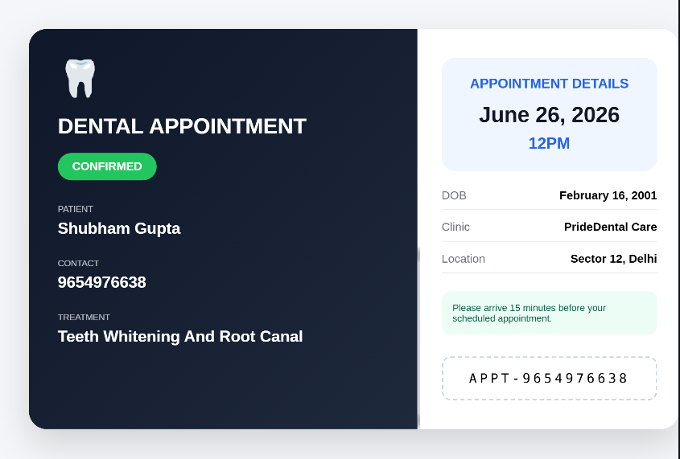

# 🦷 AI Appointment Management System

An AI-powered dental clinic appointment management system built using **n8n**, **WhatsApp Cloud API**, **Google Sheets**, **Google Calendar**, **Gemini AI**, and **PDF Automation**.

The system automates the complete appointment lifecycle, including patient data collection, appointment booking, appointment updates, alternative slot recommendations, appointment cancellation, calendar synchronization, and PDF confirmation generation.

---

## 🚀 Features

### AI-Powered Patient Interaction
- Collects patient details through WhatsApp
- Answers clinic-related questions
- Extracts appointment information using AI

### Appointment Booking
- Validates appointment date and time
- Prevents booking on unavailable dates
- Prevents booking outside clinic hours
- Creates Google Calendar events automatically

### Appointment Updates
- Update treatment type
- Update appointment date
- Update appointment time
- Automatically updates Calendar and Sheets

### Double Booking Prevention
- Checks slot availability
- Detects conflicts
- Suggests alternative available slots

### Appointment Cancellation
- Cancels calendar events
- Updates booking status
- Maintains cancellation records

### PDF Generation
- Generates appointment confirmation slips
- Sends PDF directly through WhatsApp

---

## 🛠️ Tech Stack

- n8n
- Gemini AI
- JavaScript
- WhatsApp Cloud API
- Google Calendar API
- Google Sheets API
- REST APIs
- PDF Generation

---

## 📋 Workflow Overview

1. Patient initiates conversation through WhatsApp
2. AI collects and validates appointment details
3. Google Calendar availability is checked
4. Appointment is confirmed
5. Google Sheets and Calendar are updated
6. PDF confirmation is generated
7. User can update treatment, date, or time
8. Alternative slots are suggested when required
9. User can cancel appointments
10. All systems remain synchronized automatically

---

# 🔄 n8n Workflow Architecture

---

# 📱 Patient Conversation & Data Collection

The AI assistant collects patient details and answers clinic-related questions before appointment confirmation.

### Collected Information

- Patient Name
- Contact Number
- Date of Birth
- Treatment Type
- Preferred Appointment Date
- Preferred Appointment Time

---

# 📅 Appointment Booking

After validation, the workflow automatically creates a Google Calendar event and stores the appointment record in Google Sheets.

### Google Sheets After Confirmation

### Google Calendar After Confirmation

---

# 🔄 Treatment Update

Patients can modify treatment details after booking. Changes are automatically synchronized across Google Sheets and Google Calendar.

### Treatment Update Request

### Google Sheet After Treatment Update

### Calendar After Treatment Update

---

# 🚫 Alternative Slot Recommendation & Double Booking Prevention

When a requested appointment slot is unavailable, the workflow checks existing appointments, prevents double booking, and recommends alternative available slots.

### Requested Slot Not Available

### Google Sheet After New Date & Time Confirmation

### Calendar After New Date & Time Confirmation

---

# ❌ Appointment Cancellation

Patients can cancel appointments directly through WhatsApp. The workflow updates records automatically and maintains cancellation history.

### WhatsApp Cancellation Confirmation

### Google Sheets After Cancellation

---

# 📄 PDF Confirmation Generation

The system automatically generates and sends:

- Appointment Confirmation PDF
- Updated Appointment PDF
- Appointment Summary PDF

directly through WhatsApp.

---

# 🎯 Key Benefits

- Fully automated appointment management
- AI-powered patient interactions
- Real-time appointment validation
- Double-booking prevention
- Automated calendar synchronization
- Automated PDF generation
- Centralized appointment tracking
- Reduced manual administrative workload

---

## 👨‍💻 Author

**Shubham Gupta**

AI Automation Builder | n8n Developer | AI Agents | Workflow Automation

---

> Open to opportunities in AI Automation, n8n Development, AI Agents, and Workflow Automation.
>
> Happy to discuss the architecture, automation logic, and implementation details behind this project.
